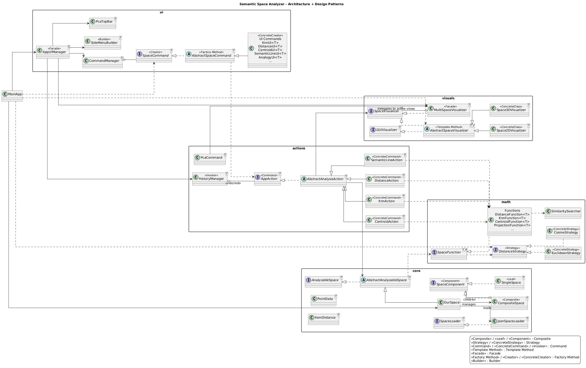

# 🌌 Semantic Space Analyzer & Visualizer

JavaFX application for analyzing and visualizing semantic spaces (word embeddings) in 2D/3D.
This project was built for an Object-Oriented Programming course, with emphasis on SOLID and practical design patterns.

---

## 1) Project Overview and Course Context

The system loads vectors from JSON files, runs mathematical analysis (distance, KNN, centroid, semantic-line projection), and presents results both as text and as interactive visualization.

From a course perspective, it demonstrates:

- layered architecture with clear responsibility boundaries
- programming against abstractions (interfaces/abstract classes)
- safe extensibility without breaking the core flow
- practical usage of classic design patterns

### What you can do in the application

- run distance queries between words
- find nearest neighbors (KNN)
- compute centroid-based similarity
- project vocabulary on a semantic line/axis
- solve analogy-style vector queries
- switch distance metric at runtime (Euclidean / Cosine / Manhattan)
- visualize results in both 2D and 3D views with highlighting
- use action history (undo/redo) and PCA projection controls

---

## 2) Package Structure and Responsibilities

| Package | Responsibility | Main classes |
|---|---|---|
| `core` | Space storage and loading | `AbstractAnalyzableSpace`, `AnalyzableSpace`, `SpaceComponent`, `SingleSpace`, `CompositeSpace`, `SpaceLoader`, `JsonSpaceLoader`, `OurSpace`, `PointData`, `ItemDistance`, `DistanceComparator` |
| `math` | Algorithms and distance metrics | `SpaceFunction`, `DistanceFunction`, `KnnFunction`, `CentroidFunction`, `ProjectionFunction`, `SimilaritySearcher`, `DistanceStrategy`, `EuclideanStrategy`, `CosineStrategy` |
| `actions` | User-level executable operations and history | `AppAction`, `AbstractAnalysisAction`, `DistanceAction`, `KnnAction`, `CentroidAction`, `SemanticLineAction`, `PcaCommand`, `HistoryManager` |
| `ui` | UI orchestration, menus, and input handling | `AppUIManager`, `CommandManager`, `SideMenuBuilder`, `PcaTopBar`, `SpaceCommand`, `AbstractSpaceCommand`, `KnnUI`, `DistanceUI`, `CentroidUI`, `SemanticLineUI`, `AnalogyUI`, `MenuSection`, `AbstractMenuSection`, `AnalysisSection`, `CalculationMethodSection`, `HistorySection`, `ZoomSection`, `UIUtils` |
| `visuals` | Rendering, highlight, and multi-view coordination | `SpaceVisualizer`, `GUIVisualizer`, `AbstractSpaceVisualizer`, `Space2DVisualizer`, `Space3DVisualizer`, `MultiSpaceVisualizer` |

---

## 3) Design Patterns Used

### Composite Pattern (`core`)
`SpaceComponent` + `SingleSpace` + `CompositeSpace` provide a unified way to work with either a single space or a group of spaces.

### Strategy Pattern (`math`)
`DistanceStrategy` with concrete implementations (`EuclideanStrategy`, `CosineStrategy`) allows runtime switching of metric logic.

### Command Pattern (`actions`)
Each analysis request is modeled as an `AppAction` object, and `HistoryManager` stores action history for undo/redo.

### Template Method Pattern (`visuals`)
`AbstractSpaceVisualizer` defines the common rendering workflow, while `Space2DVisualizer` and `Space3DVisualizer` implement the view-specific details.

### Facade Pattern (`ui` and `visuals`)
- `AppUIManager` acts as a facade for the UI layer (commands, history, PCA, and views).
- `MultiSpaceVisualizer` acts as a facade over multiple active visualizers.

### Factory Method (UI commands)
`SpaceCommand` classes construct concrete `AppAction` instances from user input through `generateAction(...)`.

### Builder Pattern (`ui`)
`SideMenuBuilder` builds the side-menu structure from reusable sections.

---

## 4) SOLID Principles in the Project

- **SRP**: each package focuses on one domain concern (data, algorithms, actions, UI, rendering).
- **OCP**: new features are usually added through new classes + registration in `MainApp`.
- **LSP**: `DistanceStrategy` and `AppAction` implementations are interchangeable via their contracts.
- **ISP**: small, focused interfaces are used (`AppAction`, `SpaceCommand`, `DistanceStrategy`, `SpaceVisualizer`).
- **DIP**: high-level flow depends on abstractions rather than concrete low-level implementations.

---

## 5) How to Extend the Project

### Add a new analysis feature (full flow)
1. Create `MyFeatureFunction` in `src/math` that **implements** `SpaceFunction<T, R>`.
2. Create `MyFeatureAction` in `src/actions` that **extends** `AbstractAnalysisAction<T>`.
3. Create `MyFeatureUI` in `src/ui` that **extends** `AbstractSpaceCommand<T>` and returns `MyFeatureAction` from `generateAction(...)`.
4. Add the new UI command to the command list in `src/MainApp.java`.

### Add a new distance metric
1. Create `MyMetricStrategy` in `src/math` that **implements** `DistanceStrategy`.
2. Add it to the strategies list in `src/MainApp.java`.
3. It becomes available automatically for commands that use the selected strategy.

### Add a new graphics view
1. Create `MySpaceVisualizer` in `src/visuals` that **extends** `AbstractSpaceVisualizer<T, V>`.
2. Implement the required rendering hooks (shape creation, highlight/unhighlight, scene clear, visual node).
3. Add the visualizer instance to the active views list in `src/MainApp.java`.

---

## 6) Architecture Diagram

  

